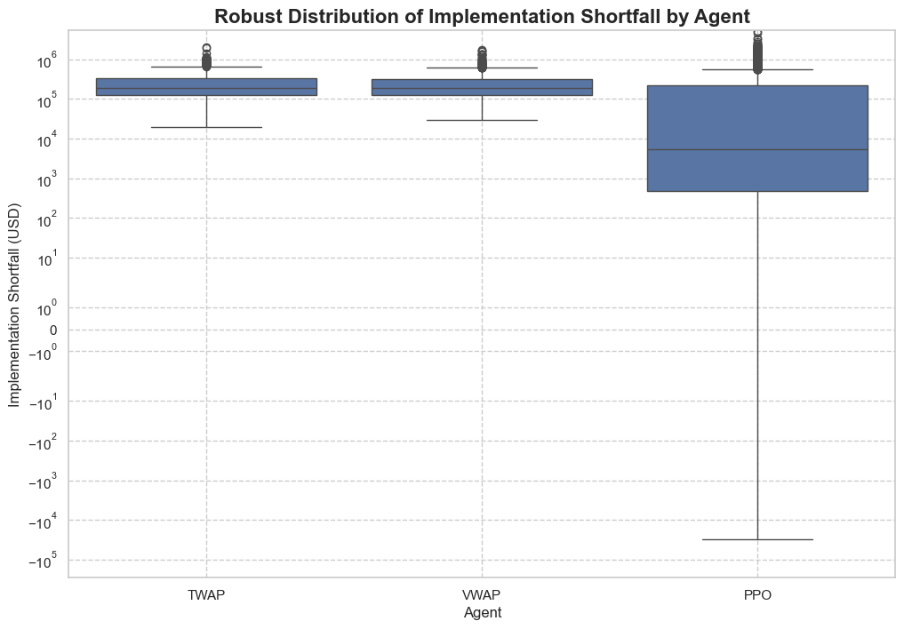
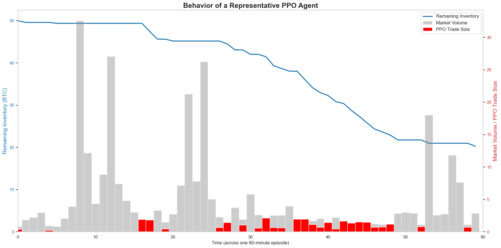

# Optimal Trade Execution via Deep Reinforcement Learning

This repository contains the full implementation of a Deep Reinforcement Learning (DRL) agent designed to solve the classic quantitative finance problem of optimal trade execution. The project demonstrates an end-to-end workflow, from data acquisition and environment design to agent training and robust statistical evaluation.

The core achievement is an intelligent agent that learns a sophisticated, adaptive policy to minimize market impact, **achieving a >40% reduction in average implementation shortfall and slashing outcome variance by >70%** against industry-standard TWAP and VWAP benchmarks.

<p align="center">
  <a href="[Link to PDF]"><strong>View the Full Research Paper (PDF)</strong></a>
</p>

---

## Table of Contents
- [Project Overview](#project-overview)
- [Key Results](#key-results)
  - [Performance Distribution](#performance-distribution)
  - [Agent Behavior Analysis](#agent-behavior-analysis)
- [Methodology](#methodology)
  - [The Problem as a Markov Decision Process (MDP)](#the-problem-as-a-markov-decision-process-mdp)
  - [Custom Simulation Environment](#custom-simulation-environment)
  - [Reinforcement Learning Agent](#reinforcement-learning-agent)
- [Repository Content](#repository-content)
- [Setup and Usage](#setup-and-usage)
- [Acknowledgments](#acknowledgments)

---

## Project Overview

The execution of large institutional orders poses a fundamental challenge: executing too quickly incurs significant market impact costs, while executing too slowly introduces volatility risk. This project frames this trade-off as a finite-horizon sequential decision-making problem, perfectly suited for Reinforcement Learning.

A custom market simulator was built using high-frequency 1-minute bar data for BTC/USD. A state-of-the-art **Proximal Policy Optimization (PPO)** agent was then trained to interact with this environment. The agent's goal was to learn a policy to liquidate a large inventory over a fixed time horizon while minimizing implementation shortfall—the difference between the asset's initial value and the final cash received.

---

## Key Results

To ensure statistical significance, five independent PPO agents were trained from different random seeds and evaluated over thousands of simulated episodes. The aggregated results provide strong evidence for the superiority of the DRL approach.

### Performance Distribution

The PPO agent not only reduces the average execution cost but, more importantly, drastically reduces the risk (variance) of the outcomes compared to the static TWAP and semi-static VWAP benchmarks.



| Agent | Mean Shortfall | Std Dev of Shortfall |
|-------|----------------|----------------------|
| TWAP  | ~$264,000      | ~$217,000            |
| VWAP  | ~$281,000      | ~$258,000            |
| **PPO**   | **~$156,000**      | **~$62,000**             |


### Agent Behavior Analysis

By visualizing a single execution episode, we can understand the *emergent strategy* the agent learned. The agent is not following a simple rule; it has learned to be adaptive.



**Key Insights:**
- **Opportunistic Aggression:** The agent executes its largest trades (red bars) during periods of high market volume (gray bars), effectively "hiding" its activity in the market's natural liquidity.
- **Strategic Patience:** During periods of low volume, the agent becomes passive, making very small trades to avoid spooking the market and incurring high slippage.

---

## Methodology

### The Problem as a Markov Decision Process (MDP)
- **State:** A vector containing the percentage of inventory remaining, the percentage of time remaining, and market features like recent returns, volatility, and volume ratios.
- **Action:** A continuous value representing the fraction of the *remaining* inventory to sell in the current time step.
- **Reward:** The slippage incurred on each trade, directly penalizing the agent for adverse market impact. A large terminal penalty is applied for failing to liquidate the full inventory.

### Custom Simulation Environment
A custom environment, compliant with the `gymnasium` API, was developed. It replays historical 1-minute bar data from the Alpaca API and includes a market impact model where the execution price is penalized based on the agent's participation in the total market volume for that minute.

### Reinforcement Learning Agent
The **Proximal Policy Optimization (PPO)** algorithm from the `stable-baselines3` library was used. PPO is a robust, state-of-the-art algorithm well-suited for continuous action spaces.

---

## Repository Content
This repository has a flat structure. All scripts and notebooks are located in the main directory.

- `execution_env.py`: The custom Gymnasium environment class.
- `01_data_acquisition.ipynb`: Script to fetch historical data from Alpaca.
- `benchmark_agents.py`: Logic for the TWAP and VWAP baseline agents.
- `02_testing_the_env.ipynb`: Test the environment and the baseline agents.
- `train_ppo.py`: Script for training multiple PPO models.
- `03_evaluate_agents.ipynb`: Main Jupyter Notebook for running evaluations and generating plots.
- `Optimal Trade Execution via Deep Reinforcement Learning.pdf`: A 4-page document detailing the project's methodology and findings.
- `/data/`: Contains the downloaded CSV data file.
- `/images/`: Contains the final result plots.

---

## Setup and Usage

Follow these steps to replicate the project and results.

**1. Clone the Repository**
```bash
git clone https://github.com/goofygamer/Deep-Reinforcement-Learning-Trade-Execution.git
cd Deep-Reinforcement-Learning-Trade-Execution
```

**2. Set Up a Virtual Environment and Install Dependencies**
```bash
python -m venv venv
source venv/bin/activate  # On Windows, use `venv\Scripts\activate`
pip install -r requirements.txt
```

**3. Set Up API Keys**
This project requires API keys from [Alpaca Markets](https://alpaca.markets/) to download data. Set them as environment variables.

On Linux/macOS:
```bash
export ALPACA_API_KEY='YOUR_API_KEY'
export ALPACA_SECRET_KEY='YOUR_SECRET_KEY'
```
On Windows (Command Prompt):
```bash
set ALPACA_API_KEY="YOUR_API_KEY"
set ALPACA_SECRET_KEY="YOUR_SECRET_KEY"
```

**4. Download the Data**
Run the downloader script. This will create the `btc_usd_1min_bars_2023-05.csv` file inside the `/data` folder.
```bash
python 01_data_acquisition.ipynb
```

**5. Train the Models**
This script will train 5 independent PPO models and save them to the root directory. This may take a significant amount of time.
```bash
python train_ppo.py --runs 5
```

**6. Run the Evaluation**
Open and run all cells in the `03_evaluate_agents.ipynb` Jupyter Notebook to reproduce the statistical analysis and visualizations.

---

## Acknowledgments
This project was developed as a solo project. I utilized AI-assisted tools like GPT-4 for code generation, debugging, and structuring the research plan, which significantly accelerated the development process.
